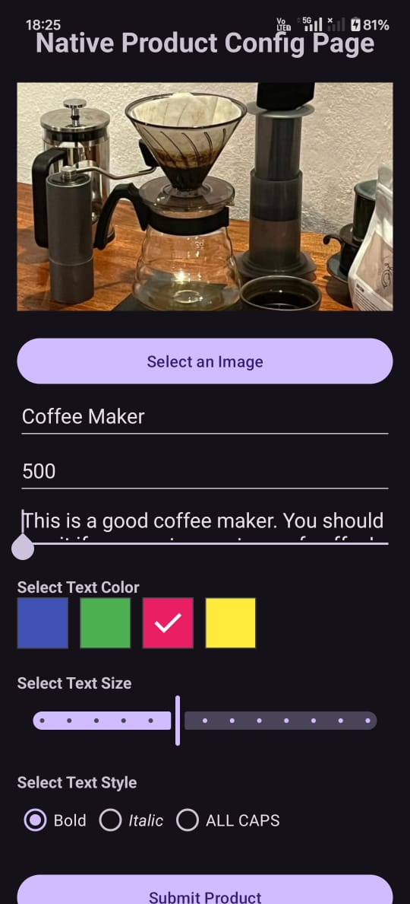
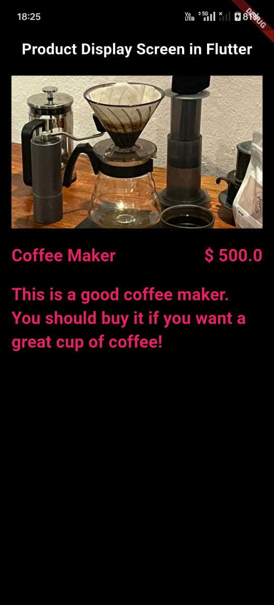

# Flutter Screen Launch from Native Android App

This project demonstrates how to launch a **Flutter screen from a Native Android (Kotlin) app**, enabling seamless integration between native and Flutter modules.

  
  

## ✨ Features

- Launch Flutter screen from an existing native Android app
- Input product details in native Android (Kotlin) UI:
  - Product Name
  - Description
  - Image URL
  - Text Color
  - Text Size
  - Text Style (bold/italic/normal)
- Display product details beautifully on the Flutter side

## 📱 How It Works

### 1. Native Android Side (Kotlin)
- A `MethodChannel` is set up to communicate with Flutter.
- `FlutterEngine` is initialized and cached using `FlutterEngineCache`.
- A `FlutterActivity` is launched to display the Flutter product description screen.

### 2. Flutter Side
- A simple Flutter UI listens for incoming data through `MethodChannel`.
- The data is parsed and shown using Flutter widgets with provided styles and values.

## 🔧 Tools & Technologies

- **Android (Kotlin)**
  - Jetpack Compose / XML (for native UI)
  - `MethodChannel`
  - `FlutterEngineCache`
  - `FlutterActivity`
- **Flutter (Dart)**
  - Stateless and Stateful Widgets
  - Platform channels for communication
  - UI customization with received parameters

## ✨ Setting up Android Project with Flutter Module

### 📱 Step 1: Create Native Android App 
Use Android Studio or:

    android create project --name MyApplication --target android-35 --path MyApplication

### 📁 Step 2: Create Flutter Module

    flutter create -t module flutter_module

This creates a reusable Flutter module (in the folder `flutter_module/`) that can be embedded into your existing or new native Android app.

### 🔧 Step 3: Configure `settings.gradle.kts` of Android App
Update your **`settings.gradle.kts`**:

    dependencyResolutionManagement {
	    repositoriesMode.set(RepositoriesMode.PREFER_SETTINGS)
	    // change to PREFER_SETTINGS
	    repositories {
	        google()
	        mavenCentral()
	        maven { url = uri("https://storage.googleapis.com/download.flutter.io") } // Flutter Maven
	    }
    } 
    
    rootProject.name = "My Application"
    include(":app")
    
    // Add Flutter module
    val filePath = "$rootDir/flutter_module/.android/include_flutter.groovy"
    apply(from = File(filePath))

### ⚙️ Step 4: Modify `build.gradle.kts` of `:app`

Ensure the following configurations in your `:app` level `build.gradle.kts`:

    android {
	    defaultConfig {
	        applicationId = "com.example.myapplication"
	        minSdk = 24
	        targetSdk = 35
	        versionCode = 1
	        versionName = "1.0"
	        
	        // add below line
	        ndk {
	            abiFilters += listOf("armeabi-v7a", "arm64-v8a", "x86_64")
	        }

	        testInstrumentationRunner = "androidx.test.runner.AndroidJUnitRunner"
	    }
    }
    
    dependencies {
	    implementation(project(":flutter")) // Link to Flutter module
	    ... // Other android dependencies
    }

### 📝 Step 5: Update `AndroidManifest.xml`

Add the following inside the `<application>` tag:

    <activity
    android:name="io.flutter.embedding.android.FlutterActivity"
    android:configChanges="orientation|keyboardHidden|keyboard|screenSize|locale|layoutDirection|fontScale|screenLayout|density|uiMode"
    android:hardwareAccelerated="true"
    android:windowSoftInputMode="adjustResize"/>

### 📤 Step 6: Pass Data from Native to Flutter Using `FlutterEngineCache`

To send data (e.g., `jsonString`) from the native module to the Flutter module, initialize and cache a `FlutterEngine`, then invoke a method on a `MethodChannel` after launching the Flutter activity:

    val engine = FlutterEngine(this)engine.dartExecutor.executeDartEntrypoint(
	    DartExecutor.DartEntrypoint.createDefault()
    )
    
    // Cache the engine
    FlutterEngineCache.getInstance().put("engine_id", engine)
    
    // Launch Flutter activity with cached engine
    val intent = FlutterActivity.withCachedEngine("engine_id").build(this)
    startActivity(intent)
    
    // Setup MethodChannel for communication
    val channel = MethodChannel(engine.dartExecutor.binaryMessenger, "com.example.myapplication/product")
    
    // Send JSON string to Flutter after slight delay
    android.os.Handler(Looper.getMainLooper()).postDelayed({
	    channel.invokeMethod("sendJson", jsonString)
    }, 1000)

### 📥 Step 7: Receive Data in Flutter via `MethodChannel`

In your Flutter module, define a `MethodChannel` and use `setMethodCallHandler` to listen for incoming data (e.g., JSON) from the native module:

    static const platform = MethodChannel('com.example.myapplication/product');
    ...
    
    void getDataFromMc() {
	    platform.setMethodCallHandler((call) async {
	    if (call.method == "sendJson") {
		      final String jsonString = call.arguments;
		      productModel = ProductModel.fromJson(jsonString);

		      setState(() {
		        debugPrint("Decode: ${productModel.toString()}");
		      });
		    } 
	    });
    }

